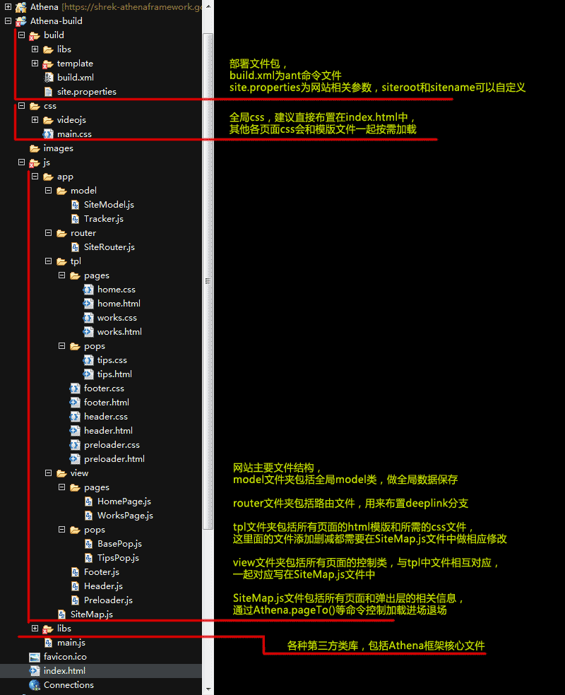
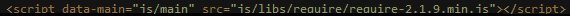

#athenaframework  
a js web framework base on backbone.js & require.js  
Athena是一个基于Backbone的js前端框架，主要功能是通过SiteMap设置的网站结构

*version:0.1.0*  
*date:2013.12.19*

*version:0.0.3*  
*date:2013.10.12*

*version:0.0.2*  
*date:2013.08.11*

*version:0.0.1*  
*date:2013.06.13*

authur:shrek.wang  
http://shrekwang.duapp.com/

##athena是什么？
js虽然强大，但是在网站开发过程中确实有很多地方用起来很不爽。比如js文件过大，不容易维护，oop开发比较弱。。。。。。这里不一一累述。  

backbone，让我们可以用js进行oop开发，创建类，继承类，覆盖扩展方法等等，  
requirejs，让我们可以把臃肿复杂的js按照模块分拆成各个模块js，按需加载使用，结合backbone，可以让我们的开发习惯延续其他语言的习惯，工程文件结构清晰，代码结构也更加友善易懂，  
jquery，功能大家都懂得，虽然稍显庞大  
underscore，非常好用的方法集，也是backbone的强依赖类  
athena，整合以上各种强大通用的第三方库，使js网站开发变得更加美好。  

Athena，让开发者可以快速搭建出网站框架，更方便的调整加载流程，层级控制，以及页面管理。  
如果开发者有使用过as3下的开发框架gaia framework的经验就可以更快更好的理解这一点  
本框架志在简化管理网站页面结构，方便页面切换，对表现层不做任何干预。  
支持ie7+，firefox，chrome等所有主流浏览器

##athena适合干什么？
athena适合开发跨平台的单页应用网站，如活动的minisite，产品演示网站等等

##Athena API:
**init(stage);**  
设置关联根节点，初始化框架

**flow("normal"|"preload"|"reverse"|"cross");**  
设置页面切换流程

**pageTo(data);**  
*data*为节点对象 pagedata,一般情况下节点数据在sitemap.js中设置,一般转场都用这条命令即可  
*data*也可以为节点信息的数组 [pagedata,pagedata,pagedata]，会统一加载后一起执行进场程序  
*pagedata*:{title:"home",routing:"首页",view:"app/view/HomePage",template:"app/template/home.html",depth:"top",flow:"normal"}  
*title*:用于识别区分，暂时无用  
*routing*:用于设置页面标头文本  
*view*:每个页面的js文件地址，  
*template*:为页面模板html文件地址，  
*depth*:显示深度，可以使用关键词"preload","top","middle","bottom",也可以使用通配符"+","-",例如"top-"  
*flow*:当前页面进场时流程设置，无效则使用全局流程  
	
**pageOn(data);**  
*data*为SiteMap节点对象,效果同pageTo(data);

**pageOff(data);**  
*data*为SiteMap节点对象,此处也可以传string字符串，或者数字，用户指定页面中某层级的内容退场，也可以指定一个数组的页面一起退场

**preloader(data,{complete:function});**  
*data*为节点对象，function为加载设置完成的回调函数，data为空则取消preload显示组件

**fullScreen(bool);**  
*bool*为布尔值，是否设置全屏，true为全屏显示无滚动条，false为普通显示，滚动条显示状态为auto。rect设置全屏状态下的最小分辨率，低于此分辨率强制出现滚动条(默认值为1000x560)。  
**fullScreen();**  
返回bool布尔值

**windowRect(rect);**  
*rect*设置当前窗口分辨率  
**windowRect();**  
获取当前窗口分辨率

**windowRectMin(rect);**  
*rect*设置窗口最小分辨率  
**windowRectMin();**  
获取窗口最小分辨率

**stageRect(rect);**  
*rect*设置当前场景分辨率  
**stageRect();**  
获取当前场景分辨率

**getPage(data);**  
获取指定data的页面实例

**getPageAt(depth);**  
获取指定depth层级的页面实例

**resize();**  
当页面尺寸变化时自动调用，发布resize事件

##Athena EVENTS:
**Athena.trigger(this.WINDOW_RESIZE);**
**Athena.trigger(self.PRELOAD_PREPARE);**
**Athena.trigger(this.FLOW_COMPLETE, {data:当前流程的页面信息});**
**Athena.trigger(this.FLOW_START, {data:当前流程的页面信息});**

##Athena CONST:
页面深度常量  
**PRELOAD:"preload"**  等价于z-index = 1000
**TOP:"top"**          等价于z-index = 500
**MIDDLE:"middle"**    等价于z-index = 0
**BOTTOM:"bottom"**    等价于z-index = -500

页面切换方式常量  
**NORMAL:"normal"**    普通切换方式：1。当前页面退场。2。加载新页面。3。新页面进场。
**PRELOAD:"preload"**  预载切换方式：1。加载新页面。2。当前页面退场。3。新页面进场。
**REVERSE:"reverse"**  反转切换方式：1。加载新页面。2。新页面进场。3。当前页面退场。
**CROSS:"cross"**      交叉切换方式：1。加载新页面。2。新页面进场。当前页面退场。同时进行。

页面间切换状态常量  
**FLOW_START:"flowStart"**           页面切换流程开始时发布此事件  
**FLOW_COMPLETE:"flowComplete"**     页面切换流程结束时发布此事件  
**WINDOW_RESIZE:"windowResize"**     窗体尺寸变化时发布此事件  
**PRELOAD_PREPARE:"preloadPrepare"** 预载页准备完成时发布此事件（常用于网站开始前侦听此事件）

##build包使用简介：
将build包下载放到网站目录下，  
修改site.properties文件中的site值，设置为网站相对当前build目录的相对路径  
将build.xml装载进ant，使用相关命令  
**create**   将网站创建到之前site地址指定的位置  
**clean**    清除site下相关网站文件及目录（慎用！！！）  
**compile**  发布并优化css文件夹和js文件夹下文件，template中的html文件会自动打包成js文件以方便cdn跨域调用  
目前compile命令只适用于windows系统  

##网站文件结构：
Athena.js 为框架主文件，组织图解如下：  
  

如上图，  
athenaframework/ 为框架文件所在，Athena.js为主文件。athenaframework/base/下为各种基类文件，用于继承使用  
app/ 为网站文件所在，SiteMap.js记录网站所有的页面节点，
main.js 里需要为所有使用的js文件注册一个对应的变量名，以方便以后的js文件来书写依赖关系。(开发中别忘记每个新建的模块js需要在main中注册一个变量，使用起来才更方便，这里需要熟悉requirejs的使用方法)

在首页html中只需加入一行  

即可载入并启动整站  

##应用案例：
http://kyrios.hvsop.cn/  
http://outdoor.adidasevent.com/?cid=1  
