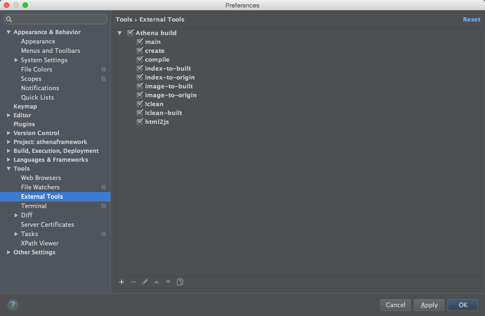
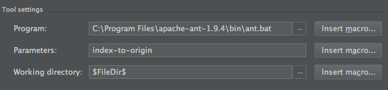

#Athenaframework  
a js web framework base on backbone.js & require.js  
Athena是一个基于Backbone和requirejs的前端框架。结构清晰，管理方便。

##Athena是什么？
各位前端开发者都了解，js虽然强大，但是在网站开发过程中确实有很多地方用起来不是很爽。比如开发过程中单个js文件写的很大，不容易维护，oop开发方面也比较弱。。。。。。这里不一一累述。  
特别是从其他领域（比如aser）转过来的jser们，这些问题更加明显，写起来更加不习惯。  
当然js中也有很多优秀的框架和第三方库来解决这些问题，比如下面这些  

backbone，优秀的mvc框架，方便oop开发，让大家继续使用熟悉的创建类，继承类，覆盖扩展方法等等，此处使用了简化版bone。  
requirejs，让我们可以把臃肿复杂的js按照模块分拆，然后按需加载使用，结合backbone，可以让我们的开发习惯延续其他语言的习惯，工程文件结构清晰，代码结构也更加友善易懂，  
jquery，功能大家都懂得，虽然稍显庞大，移动端可以替换成zepto。  
TweenMax，功能强大的第三方类库，原as下就很好用，出了js版后延续了易用强大的特点，继续成为html网站开发不可或缺的运动控制类，移动端可以替换成小巧强大的jstween或者csstween。  

Athena，整合以上各种强大通用的第三方库，使html网站开发变得更加美好。  
让开发者可以快速搭建网站，更方便的调整加载流程，层级控制，以及页面管理。对表现层不做任何干预。  
如果开发者有使用过as3下的开发框架gaia framework的经验就可以更快更好的理解这一点  
支持ie7+，firefox，chrome等所有主流浏览器

##Athena适合做什么？  
athena适合开发跨平台的单页应用网站，如活动的minisite，产品演示网站等等

##Athena如何使用？  
在使用athena框架之前需要先安装nodejs客户端：http://nodejs.org/  
在你的开发环境中需要安装ant插件，eclipse或者aptana的ant插件安装可以参考链接：http://www.netvisions.eu/component/k2/item/33-ant/33-ant.html  

将build包下载放到网站目录下，  
  

build/site.properties 为配置参数文件  
**siteName** 指定网站名称，会替换到index.html中的title  
**sitePath** 指定网站素材所在目录（包括css,js,images等等），默认是相对当前build工具包的父级目录，如需修改请保持${build}开头不变。  
**indexPath** 指定网站首页index.html所在目录，很多时候index可能会放在与其他素材不在同一目录。  
**indexFixPath** 补偿路径，指定sitePath相对于indexPath的相对路径，这里需要开发者设置正确，这里请务必保证正确的相对地址。  
**imageMatch** 查找所有js，html，css文件中的此字段  
**imageReplace** 替换image_match查找到的值  

build/site.xml 为网站结构配置文件  
这里的结构很简单，总共五种标签，preloader，header，footer，page，pop，语意明确，这里不多赘述，一般情况下只要增加page和pop的节点就可以。  
节点参数有depth, fast ready  
**depth** 是指定层级，每种节点都有默认值，preloader默认depth是preload，header一般需要指定到'top-1'，footer指定到'top-2'，具体含义可以参看查看后面api中的pagedata部分。  
**fast** 参看查看后面api中的pagedata部分。  
**ready** 是特殊参数，只对preloader节点有用，需要前置loading时会就指定为true，一个网站只会有一个前置loading。    

build/build.xml为ant命令集，具体部署命令详见下方built命令介绍  
  

##ant命令介绍：  
将build.xml装载进ant，使用相关命令  
**create**   将根据site.xml的配置发布到sitePath指定的目录下，index.html也会发布到indexPath指定目录下  
**compile**  发布并优化css文件夹和js文件夹下文件，生成新的优化文件包，以-build结尾。最后会将index.html中相关地址指向新的优化文件包，打包优化配置文件再build/optimize/下的js-build.js和css-build.js文件，相关打包的部分需要熟悉requirejs的打包规则，一般情况下，需要先把main.js下的paths部分拷贝过来替换js-build.js的paths，以保证两边内容相同，下方的modules也要根据site.xml的增减做相关调整，这部分没有自动代码帮助生成，需要手工调整。包括各个页面的依赖关系也要根据不同情况手工调整，这里是考验requirejs打包经验的地方。建议开发中多次调试打包测试，require打包还是经常有奇怪状况发生的。  
**index-to-built** 将index.html中的css和js指向压缩过的built文件夹  
**index-to-origin** 将index.html中的css和js指向原始文件夹  
**image-to-built** 将built文件夹中的css和js文件内所有image_match字段替换成image_replace  
**image-to-origin** 与image-to-built命令的反效果  
**!clean**    清除site下相关网站文件及目录（慎用！！！）  
**!clean-built**    清除site下所有压缩过的built文件夹  

其他：ant命令在webstorm中的使用，步骤图示如下：
mac下选择WebStorm > Preferences，windows下选择File > Settings  
  

选择Tools > External Tools，添加相关命令  
  

在windows系统中的不同处，ant存在的地址不同  
  

右键点击项目build文件夹，选择相关命令  
  
**注：mac版的ant安装比windows麻烦些，可以搜索查阅一下相关资料。  
这里提供一篇参考：http://blog.csdn.net/crazybigfish/article/details/18215439  
这里的命令已经更新，设置时命令中的$已经去掉**  

##Athena API:  
Athena所有命令都置于Athena下，

**init(stage);**  
设置关联根节点，初始化框架

**flow("normal"|"preload"|"reverse"|"cross");**  
设置页面切换流程,具体含义请参考下方常量说明

**pageOn(data);**  
*data*为节点对象 pagedata,一般情况下节点数据在sitemap.js中设置,一般转场都用这条命令即可  
*data*也可以为节点信息的数组 [pagedata,pagedata,pagedata]，会统一加载后一起执行进场程序  
--**pagedata**:{title:"home",routing:"首页",view:"app/view/HomePage",tpl:"app/tpl/home.html",css:"app/tpl/home",depth:"top",flow:"normal",fast:"false",assets:[]}  
--*title*:用于识别区分，暂时无用  
--*routing*:用于设置页面标头文本  
--*view*:每个页面的js文件地址，  
--*tpl*:为页面模板html文件地址，  
--*css*:为页面的css文件地址，  
--*depth*:显示深度，可以使用关键词"preload","top","middle","bottom",也可以使用通配符"+","-"数字.例如"top-1",意为top层的下一层  
--*flow*:当前页面进场时流程设置，无效则使用全局流程  
--*assets*:当前页面需要额外加载的图片数组  
--*fast*:是否快速加载（跳过所有图片加载）  
新增参数类型：
*data*也可以设置为{data:pagedata,el:dom}，同理也可以组成这样的数组 [{data:pagedata},{data:pagedata,el:dom},pagedata]  

**pageTo(data);**  
*data*为SiteMap节点对象,效果同pageOn(data);  

**pageOff(data);**  
*data*为SiteMap节点对象,此处也可以传string字符串，或者数字，用户指定页面中某层级的内容退场，也可以指定一个数组的页面一起退场  

**preload(data);**  
*data*为SiteMap节点对象,直接开始后台预加载，完成后触发全局事件 Athena.BACKLOAD_COMPLETE;  

**preloader(data);**  
*data*为节点对象，参数类型请参考pageOn()，data相关文件加载准备完成后会发出事件:Athena.PRELOAD_PREPARE  
返回当前preloader对象，不传参则获取当前preloader对象  

**preloadFast(bool);**  
*bool*为布尔值，是否跳过预载。true时在加载完html和css文件后立即置入场景触发进场。false时会在html页面中所有assets/img标签的图片全部加载完成后置入场景触发进场动画。  
**preloadFast();**  
返回bool布尔值  

**preloadMustIn(bool);**  
*bool*为布尔值，loading动画是否必须完成进场后。true时则在loading动画进场完成后开始正式加载。false时则会直接开始加载，有可能因为loading太快，直接触发loading出场而导致看不到loading界面的存在。  
**preloadMustIn();**  
返回bool布尔值  

**fullScreen(bool);**  
*bool*为布尔值，是否设置全屏，true为全屏显示无滚动条，false为普通显示，滚动条显示状态为auto。rect设置全屏状态下的最小分辨率，低于此分辨率强制出现滚动条(默认值为1x1)。  
**fullScreen();**  
返回bool布尔值  

**windowRect();**  
获取当前窗口分辨率  

**windowRectMin(rect);**  
*rect*设置窗口最小分辨率  
**windowRectMin();**  
获取窗口最小分辨率  

**stageRect();**  
获取当前场景分辨率  

**getPage(data);**  
获取指定data的页面实例  

**getPageAt(depth);**  
获取指定depth层级的页面实例,默认depth为0，即"middle"层。  

**resize();**  
当页面尺寸变化时自动调用，发布resize事件。需要时也可以主动调用，所有page扩展页会响应全局resize事件一起刷新。

##Athena EVENTS:
**Athena.trigger(Athena.WINDOW_RESIZE);**  
**Athena.trigger(Athena.PRELOAD_PREPARE);**  
**Athena.trigger(Athena.FLOW_COMPLETE, {data:当前流程的页面信息});**  
**Athena.trigger(Athena.FLOW_START, {data:当前流程的页面信息});**  
使用Backbone的on或listenTo就可以监听这些全局事件。  

##Athena CONST:
页面深度常量  
**PRELOAD:"preload"**  等价于z-index = 1500  
**TOP:"top"**          等价于z-index = 1000  
**MIDDLE:"middle"**    等价于z-index = 500  
**BOTTOM:"bottom"**    等价于z-index = 0  
Athena.api.getPageAt(depth);此命令有时会需要用到这些变量以获取相应层级的页面。  

页面切换方式常量  
**NORMAL:"normal"**    普通切换方式：1。当前页面退场。2。加载新页面。3。新页面进场。  
**PRELOAD:"preload"**  预载切换方式：1。加载新页面。2。当前页面退场。3。新页面进场。  
**REVERSE:"reverse"**  反转切换方式：1。加载新页面。2。新页面进场。3。当前页面退场。  
**CROSS:"cross"**      交叉切换方式：1。加载新页面。2。新页面进场。当前页面退场。同时进行。  
Athena.api.flow(flow);此命令会用到这些变量以用来设置页面切换方式。  

页面间切换状态常量  
**FLOW_START:"flowStart"**           页面切换流程开始时发布此事件  
**FLOW_COMPLETE:"flowComplete"**     页面切换流程结束时发布此事件  
**WINDOW_RESIZE:"windowResize"**     窗体尺寸变化时发布此事件  
**PRELOAD_PREPARE:"preloadPrepare"** 预载页准备完成时发布此事件（常用于网站开始前侦听此事件）  
这些是全局事件变量，任何地方有需要都可以通过使用Backbone的on或listenTo就可以监听这些全局事件。  

主流程加载相关常量  
**PRELOAD_START: "preloadStart"**       加载开始时发布此事件  
**PRELOAD_PROGRESS: "preloadProgress"** 加载进行时发布此事件  
**PRELOAD_COMPLETE: "preloadComplete"** 加载完成时发布此事件  

后台加载相关常量  
**BACKLOAD_COMPLETE: "backloadComplete"** 后台加载完成时发布此事件  

##Athena 相关基类:  
Athena所有基类都置于Athena下  
**View**   为视图类基类，当页面中有需要添加新元素是可以直接继承此类做各种扩展  
    init:function(){ },  
    destroy:function(){ },  
    resize:function(){ }  
另：本基类含有两个方法：  
addChild(view,$dom); 将视图类加入view视图类中，添加入page页面类的view视图会跟随page类执行resize()和destroy().  
removeChild(view);   将视图类移出view视图类。移出后自动执行destroy();  

**Page**   为页面类的基类，所有page和pop都继承自此类，继承并可以覆写的方法如下（可参考js/app/view/下页面和弹窗文件）：  
    init:function(){ },  
    destroy:function(){ },  
    resize:function(){ },  
    transitionIn:function(){ },  
    transitionInComplete:function(){ },  
    transitionOut:function(){ },  
    transitionOutComplete:function(){ }  

##Athena 扩展组件:  
组件在app/js/libs/athena/ui/下，目前可以使用的组件只有两个，  
scroller 范例参考workspage  

##网站文件结构：
Athena.js 为框架主文件，组织图解如下：  
  
如上图，  
athena框架核心文件位于*libs/athena/*文件夹中  
app/ 为网站文件所在，map.js记录网站所有的页面节点，
main.js 里需要为所有使用的js文件注册一个对应的变量名，以方便以后的js文件来书写依赖关系。(开发中别忘记每个新建的模块js需要在main中注册一个变量，使用起来才更方便，这里需要熟悉requirejs的使用方法)  
build/js-built.js 是requirejs打包配置文件，里面的文件对应关系需要与main.js文件相同，modules内设置需要合并的主文件，打包完成后如下图显示，会自动生成几个 *-built 文件夹  
  
发布打包的优点是将每个分页所需的html，css，js文件全部打包成一个js文件，这样大幅减少了http请求数量，也小幅减少了整体大小，并增强了加密性。  

范例中还显示了一种比较常用的特殊做法，将第一个loading页面直接做在html页面中，这样页面载入后就直接显示loading页面，等require将后面需要的主体框架文件载入后再将页面的loading视图绑定相应的loading控制类js，继续加载后续页面内容  
另一种常规做法就是主框架js文件加载完成后再加载并显示loading页面。相对来说，前种做法更好。  
  

##应用案例：
http://kyrios.hvsop.cn/  
http://pc4.hvsop.cn/  
http://outdoor.adidasevent.com/  
http://minutemaid.qq.com/  
http://msg.crayola.cn/  

##其他：
本框架仅为本人开发方便之用，如有问题，不吝赐教。QQ:274924021  

